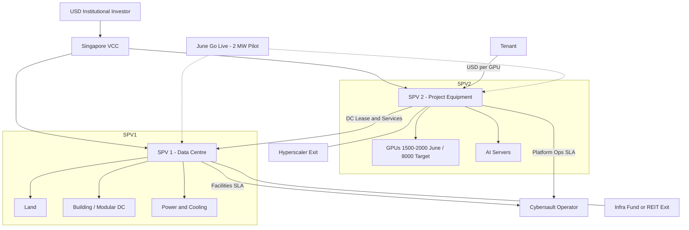

```mermaid
graph TD

Investor[USD Institutional Investor]
VCC[Singapore VCC]

Investor --> VCC

%% SPV 1 - INFRA
subgraph SPV1
SPV1_DC[SPV 1 - Data Centre]
SPV1_Land[Land]
SPV1_Building[Building / Modular DC]
SPV1_Infra[Power and Cooling]
end

VCC --> SPV1_DC
SPV1_DC --> SPV1_Land
SPV1_DC --> SPV1_Building
SPV1_DC --> SPV1_Infra

%% SPV 2 - COMPUTE
subgraph SPV2
SPV2_Core[SPV 2 - Project Equipment]
SPV2_GPUs[GPUs 1500-2000 June / 8000 Target]
SPV2_Servers[AI Servers]
end

VCC --> SPV2_Core
SPV2_Core --> SPV2_GPUs
SPV2_Core --> SPV2_Servers

%% TENANT FLOW
Tenant[Tenant]
Tenant -->|USD per GPU| SPV2_Core

%% INTER-SPV ECONOMICS
SPV2_Core -->|DC Lease and Services| SPV1_DC

%% OPERATOR
Cybersault[Cybersault Operator]
SPV1_DC -->|Facilities SLA| Cybersault
SPV2_Core -->|Platform Ops SLA| Cybersault

%% JUNE GO LIVE
June[June Go Live - 2 MW Pilot]
June -.-> SPV1_DC
June -.-> SPV2_Core

%% EXITS
ExitInfra[Infra Fund or REIT Exit]
ExitCompute[Hyperscaler Exit]

SPV1_DC --- ExitInfra
SPV2_Core --- ExitCompute
```
