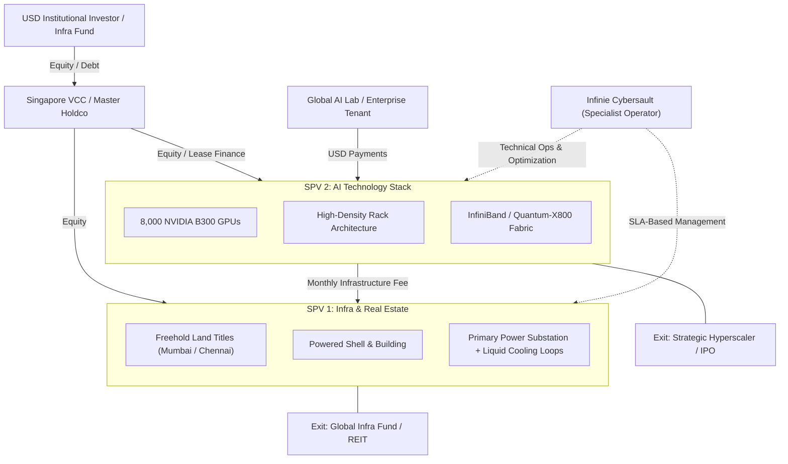

```mermaid
graph TD

%% Capital Source
Investor[USD Institutional Investor / Infra Fund]
Investor -->|Equity / Debt| VCC[Singapore VCC / Master Holdco]

%% SPV 1: Infra & Real Estate (Yield Play)
subgraph SPV_1 [SPV 1: Infra & Real Estate]
    direction TB
    Land["Freehold Land Titles (Mumbai / Chennai)"]
    Shell["Powered Shell & Building"]
    Utility["Primary Power Substation + Liquid Cooling Loops"]
end

VCC -->|Equity| SPV_1

%% SPV 2: AI Technology Stack (High IRR Play)
subgraph SPV_2 [SPV 2: AI Technology Stack]
    direction TB
    GPUs["8,000 NVIDIA B300 GPUs"]
    Servers["High-Density Rack Architecture"]
    Networking["InfiniBand / Quantum-X800 Fabric"]
end

VCC -->|Equity / Lease Finance| SPV_2

%% Operating Flows
Tenant["Global AI Lab / Enterprise Tenant"]
Tenant -->|USD Payments| SPV_2
SPV_2 -->|Monthly Infrastructure Fee| SPV_1

%% Operator
Operator["Infinie Cybersault (Specialist Operator)"]
Operator -.->|SLA-Based Management| SPV_1
Operator -.->|Technical Ops & Optimization| SPV_2

%% Exit Paths
SPV_1 --- Exit1["Exit: Global Infra Fund / REIT"]
SPV_2 --- Exit2["Exit: Strategic Hyperscaler / IPO"]
```
