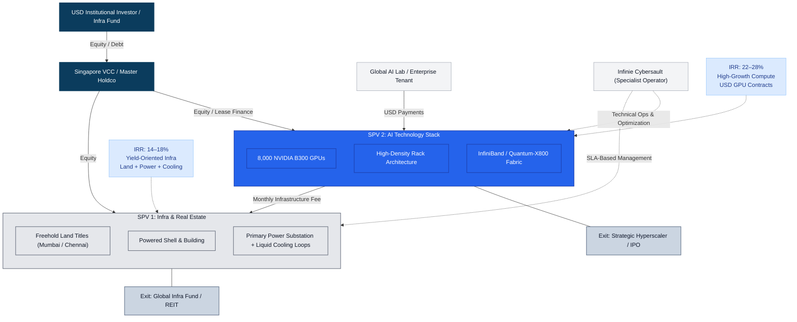

```mermaid
graph TD

%% Capital Source
Investor[USD Institutional Investor / Infra Fund]
VCC[Singapore VCC / Master Holdco]

Investor -->|Equity / Debt| VCC

%% SPV 1: Infra & Real Estate
subgraph SPV_1 [SPV 1: Infra & Real Estate]
    direction TB
    Land["Freehold Land Titles (Mumbai / Chennai)"]
    Shell["Powered Shell & Building"]
    Utility["Primary Power Substation + Liquid Cooling Loops"]
end

VCC -->|Equity| SPV_1

%% SPV 2: AI Technology Stack
subgraph SPV_2 [SPV 2: AI Technology Stack]
    direction TB
    GPUs["8,000 NVIDIA B300 GPUs"]
    Servers["High-Density Rack Architecture"]
    Networking["InfiniBand / Quantum-X800 Fabric"]
end

VCC -->|Equity / Lease Finance| SPV_2

%% Operating Flows
Tenant["Global AI Lab / Enterprise Tenant"]
Tenant -->|USD Payments| SPV_2
SPV_2 -->|Monthly Infrastructure Fee| SPV_1

%% Operator
Operator["Infinie Cybersault (Specialist Operator)"]
Operator -.->|SLA-Based Management| SPV_1
Operator -.->|Technical Ops & Optimization| SPV_2

%% Exit Paths
Exit1["Exit: Global Infra Fund / REIT"]
Exit2["Exit: Strategic Hyperscaler / IPO"]

SPV_1 --- Exit1
SPV_2 --- Exit2

%% IRR Annotations (as nodes – GitHub safe)
IRR1["IRR: 14–18%
Yield-Oriented Infra
Land + Power + Cooling"]
IRR2["IRR: 22–28%
High-Growth Compute
USD GPU Contracts"]

IRR1 -.-> SPV_1
IRR2 -.-> SPV_2

%% -------- STYLING --------
classDef capital fill:#0B3C5D,color:#ffffff,stroke:#0B3C5D,stroke-width:2px
classDef infra fill:#E5E7EB,color:#111827,stroke:#6B7280,stroke-width:1.5px
classDef compute fill:#2563EB,color:#ffffff,stroke:#1E40AF,stroke-width:1.5px
classDef annotation fill:#DBEAFE,color:#1E3A8A,stroke:#93C5FD,stroke-width:1px
classDef neutral fill:#F3F4F6,color:#111827,stroke:#9CA3AF,stroke-width:1px
classDef exit fill:#CBD5E1,color:#0F172A,stroke:#64748B,stroke-width:1.5px

class Investor,VCC capital
class SPV_1,Land,Shell,Utility infra
class SPV_2,GPUs,Servers,Networking compute
class IRR1,IRR2 annotation
class Tenant,Operator neutral
class Exit1,Exit2 exit
```
